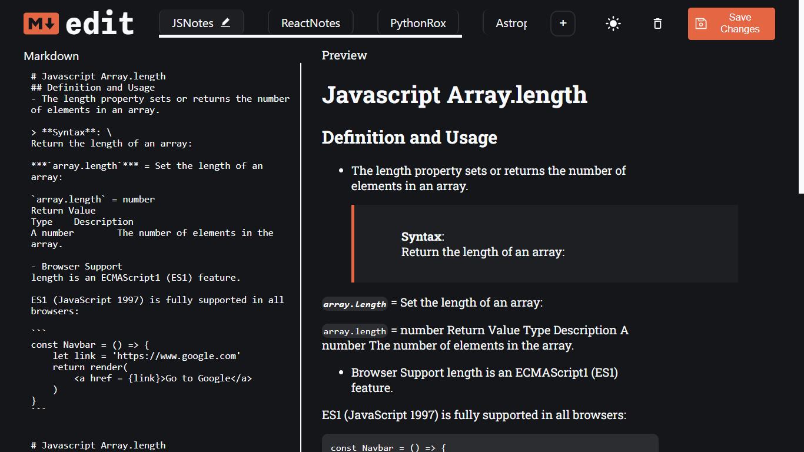

# MERN Markdown Editor

-   This is a fully functional Markdown editor created using MERN (MongoDB, ExpressJS, ReactJS, and NodeJS).
-   It has a server API that performs all CRUD operations on the markdown notes stored in the DB.
-   The front-end has a light and dark theme option.
-   The front-end has a fully functional multiple-tab option that can be used to simultaneously work on different markdown files.

## Screenshots:

## Setup

-   `npm i` installs all the dependencies needed to run the application.
-   `npm start` starts the React front-end.
-   Run `cd server` in a new terminal window.
-   Run `npm start` inside it to start the server.
